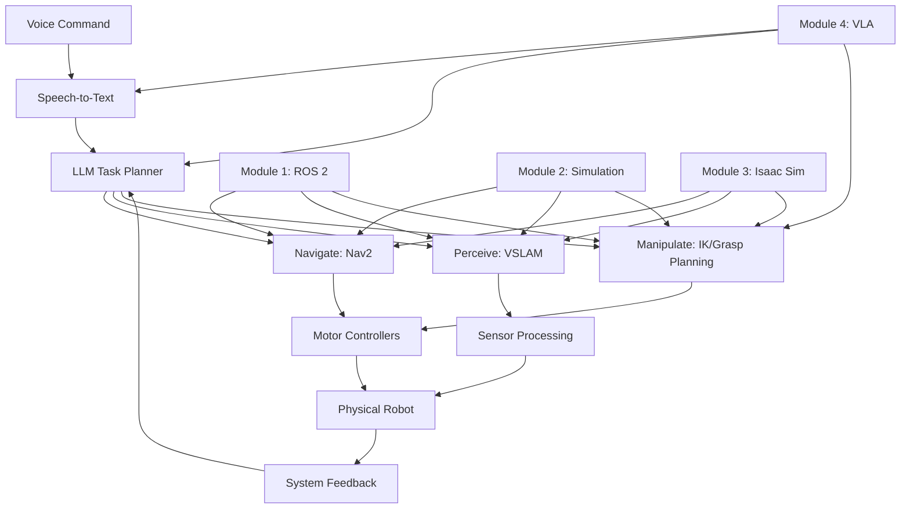
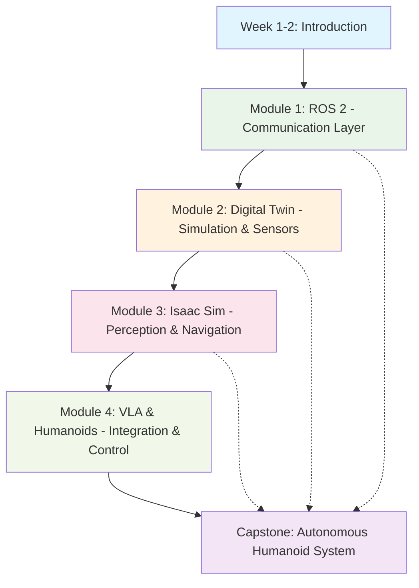

import LearningObjectives from '@site/src/components/LearningObjectives';
import Prerequisites from '@site/src/components/Prerequisites';

# Capstone: Autonomous Humanoid System

<LearningObjectives objectives={frontMatter.learning_objectives} />
<Prerequisites prereqs={frontMatter.prerequisites} estimatedTime={frontMatter.estimated_time} />

---

## Capstone Overview

The Autonomous Humanoid System represents the culmination of all skills learned throughout this course. This capstone project integrates all four modules to create a complete system that can receive voice commands and execute them as physical actions.

Your system will implement the following 5-step architecture:

1. **Voice**: Receive and interpret natural language commands
2. **Plan**: Decompose high-level commands into executable robot behaviors
3. **Navigate**: Move the humanoid to required locations
4. **Perceive**: Sense and understand the environment
5. **Manipulate**: Execute physical interactions with objects

## 5-Step Architecture Guide

### Step 1: Voice → Natural Language Processing

**Module 4 (VLA & Humanoids)** provides the foundation for voice command processing:

- **Speech-to-Text**: Convert spoken commands to text using speech recognition APIs
- **Intent Understanding**: Use Large Language Models (LLMs) to interpret user intent
- **Command Parsing**: Extract relevant information (objects, locations, actions) from commands

**Example Pipeline**:
```
User: "Please bring me the red cup from the kitchen table"
    ↓
[Speech Recognition] → "Please bring me the red cup from the kitchen table"
    ↓
[LLM Parser] → Intent: "bring_object", Object: "red cup", Location: "kitchen table"
```

### Step 2: Plan → Task Decomposition

**Module 4 (VLA & Humanoids)** and **Module 3 (Isaac Sim)** enable task planning:

- **Behavior Trees**: Structure complex tasks as sequences of simpler behaviors
- **Path Planning**: Plan navigation routes avoiding obstacles
- **Action Sequencing**: Order manipulation actions logically (approach → grasp → lift → transport → place)

**Example Pipeline**:
```
Intent: "bring_object", Object: "red cup", Location: "kitchen table"
    ↓
[Task Planner] → Subtasks:
  1. Navigate to kitchen table
  2. Locate red cup
  3. Approach red cup
  4. Grasp red cup
  5. Lift red cup
  6. Navigate to user
  7. Hand over red cup
```

### Step 3: Navigate → Autonomous Mobility

**Module 3 (Isaac Sim)** provides navigation capabilities:

- **SLAM**: Simultaneous Localization and Mapping for environment awareness
- **Path Planning**: Use Nav2 for global and local path planning
- **Obstacle Avoidance**: Dynamic obstacle detection and avoidance during navigation
- **Localization**: Maintain accurate position estimation in the environment

**Example Pipeline**:
```
Destination: kitchen table
    ↓
[Global Planner] → Path to kitchen table
    ↓
[Local Planner] → Velocity commands to follow path
    ↓
[Controller] → Motor commands to execute navigation
```

### Step 4: Perceive → Environmental Awareness

**Module 2 (Digital Twin) and Module 3 (Isaac Sim)** enable perception:

- **Object Detection**: Identify and locate objects using computer vision
- **Scene Understanding**: Interpret spatial relationships between objects
- **Sensor Fusion**: Combine data from multiple sensors (cameras, LiDAR, IMU)
- **Semantic Mapping**: Associate object identities with spatial locations

**Example Pipeline**:
```
Camera Input: Image of kitchen table
    ↓
[Object Detection] → Bounding boxes for objects on table
    ↓
[Classification] → "Red cup detected at coordinates (x, y, z)"
    ↓
[Localization] → Transform coordinates to robot's reference frame
```

### Step 5: Manipulate → Physical Interaction

**Module 4 (VLA & Humanoids)** enables manipulation:

- **Kinematics**: Calculate joint angles for desired end-effector poses (forward/inverse kinematics)
- **Grasp Planning**: Determine optimal grasp points and configurations
- **Force Control**: Apply appropriate forces during manipulation
- **Trajectory Execution**: Execute smooth, coordinated movements

**Example Pipeline**:
```
Object: red cup at (x, y, z)
    ↓
[IK Solver] → Joint angles for reaching pose
    ↓
[Grasp Planner] → Optimal grasp configuration
    ↓
[Controller] → Motor commands to execute grasp
```

## Chapter Mappings

The following chapters from each module contribute to the capstone system:

### Module 1: ROS 2 (Communication Layer)
- **Week 3**: ROS 2 Architecture → System communication backbone
- **Week 4**: Topics & Services → Inter-module communication
- **Week 5**: URDF → Robot model definition

### Module 2: Digital Twin (Simulation & Testing)
- **Week 6**: Gazebo Simulation → Safe testing environment
- **Week 7**: Unity Sensors → Photorealistic sensor simulation

### Module 3: Isaac Sim (Perception & Navigation)
- **Week 8**: Isaac Sim Setup → GPU-accelerated simulation
- **Week 9**: VSLAM & Nav2 → Localization and navigation
- **Week 10**: Reinforcement Learning → Manipulation policy training

### Module 4: VLA & Humanoids (Integration & Control)
- **Week 11**: Humanoid Kinematics → Manipulation control
- **Week 12**: Manipulation Primitives → Grasping and manipulation
- **Week 13**: Conversational VLA → Voice-to-action pipeline

## System Architecture

The complete system architecture integrates all components:



## Capstone Project Requirements

### Functional Requirements
1. **Voice Interface**: Accept and process natural language commands
2. **Task Planning**: Decompose high-level commands into executable actions
3. **Navigation**: Move to specified locations autonomously
4. **Perception**: Identify and locate specified objects
5. **Manipulation**: Execute physical interactions with objects
6. **Integration**: All modules work together seamlessly

### Technical Requirements
1. **ROS 2**: All communication uses ROS 2 topics, services, and actions
2. **Modularity**: Components are modular and reusable
3. **Documentation**: Comprehensive documentation for all components
4. **Testing**: Unit tests for critical components
5. **Performance**: System responds to commands within 30 seconds

### Evaluation Criteria
- **Functionality** (40%): Does the system complete the requested tasks?
- **Robustness** (25%): How well does the system handle unexpected situations?
- **Efficiency** (20%): How efficiently does the system execute tasks?
- **Documentation** (15%): Quality and completeness of documentation

## Getting Started

1. **Review All Modules**: Ensure you understand all components from previous modules
2. **Set Up Environment**: Install all required dependencies from previous modules
3. **Start Simple**: Begin with a basic navigation task before adding complexity
4. **Iterate**: Build and test components incrementally
5. **Integrate**: Combine components systematically

## Visual Learning Pathway

The following diagram illustrates the progression through the modules and their dependencies for the capstone project:



## Module Dependencies

Each module builds upon the previous ones:

- **Module 1 (ROS 2)**: Provides the communication backbone for all subsequent modules
- **Module 2 (Digital Twin)**: Requires ROS 2 knowledge, provides simulation environment for testing
- **Module 3 (Isaac Sim)**: Requires ROS 2 and simulation knowledge, adds perception and navigation
- **Module 4 (VLA & Humanoids)**: Integrates all previous modules, adds voice and manipulation

## Capstone Integration Points

The capstone project integrates components from all modules:

- **Voice Component**: From Module 4 (VLA & Humanoids)
- **Planning Component**: From Module 4 (VLA & Humanoids) with LLM integration
- **Navigation Component**: From Module 3 (Isaac Sim) with Nav2
- **Perception Component**: From Module 3 (Isaac Sim) with VSLAM
- **Manipulation Component**: From Module 4 (VLA & Humanoids) with kinematics

## Resources

- [Module 1: ROS 2](../module-1-ros2) - Communication backbone
- [Module 2: Digital Twin](../module-2-digital-twin) - Simulation and testing
- [Module 3: Isaac Sim](../module-3-isaac) - Perception and navigation
- [Module 4: VLA & Humanoids](../module-4-vla-humanoids) - Integration and control
- [Glossary](../references/glossary) - Key terminology
- [Troubleshooting Guide](../references/troubleshooting) - Common issues and solutions